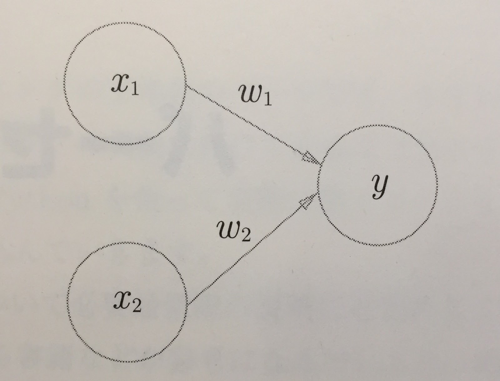

# 2章 パーセプトロン

パーセプトロンはディープラーニングの起源

### 2.1 パーセプトロン

$x_1$, $x_2$:入力信号

$w_1$, $w_2$:重み

$y$:出力信号(2値、0:信号なし 1:信号あり)

$\theta$:しきい値

##### □ パーセプトロンの原理

$$
y =
\begin{cases}
0 & (w_1 x_1 + w_2 x_2 \leqq \theta)\\
1 & (w_1 x_1 + w_2 x_2 > \theta)
\end{cases}
$$

重みが大きいほど、その入力に対する信号の重要度が大きくなる。

### 2.2 単純な論理回路

#### 2.2.1 ANDゲート

ANDゲートの真理値表

| $x_1$ | $x_2$ | $y$ |
| ----- | ----- | --- |
| 0     | 0     | 0   |
| 1     | 0     | 0   |
| 0     | 1     | 0   |
| 1     | 1     | 1   |

Q:ANDゲートをパーセプトロンで表現したいがどうすればいいか？

A:真理値表を満たすように $w_1$, $w_2$, $\theta$を決めれば良い。
$(w_1, w_2, \theta)$は無数にある。
例えば、$(0.5, 0.5, 0.7)$

| $x_1$ | $x_2$ | $w_1x_1+w_2x_2$ | $w_1x_1+w_2x_2 > \theta$ |
| ----- | ----- | --------------- | ------------------------ |
| 0     | 0     | 0               | 偽                       |
| 1     | 0     | 0.5             | 偽                       |
| 0     | 1     | 0.5             | 偽                       |
| 1     | 1     | 1.0             | 真                       |

-> 真理値表を満たせた！！！

#### 2.2.2 NANDゲートとORゲート

NANDゲートの真理値表

| $x_1$ | $x_2$ | $y$ |
| ----- | ----- | --- |
| 0     | 0     | 1   |
| 1     | 0     | 1   |
| 0     | 1     | 1   |
| 1     | 1     | 0   |

Q:NANDゲートを満たす、$(w_1, w_2, \theta)$を示せ

A:無数にあるが、例えば$(-0.5, -0.5, -0.7)$.

| $x_1$ | $x_2$ | $w_1x_1+w_2x_2$ | $w_1x_1+w_2x_2 > \theta$ |
| ----- | ----- | --------------- | ------------------------ |
| 0     | 0     | 0               | 真                       |
| 1     | 0     | -0.5            | 真                       |
| 0     | 1     | -0.5            | 真                       |
| 1     | 1     | -1.0            | 偽                       |

-> 真理値表を満たせた！！！

ORゲートの真理値表

| $x_1$ | $x_2$ | $y$ |
| ----- | ----- | --- |
| 0     | 0     | 0   |
| 1     | 0     | 1   |
| 0     | 1     | 1   |
| 1     | 1     | 1   |

Q:ORゲートを満たす、$(w_1, w_2, \theta)$を示せ

A:無数にあるが、例えば$(0.5, 0.5, 0)$.

| $x_1$ | $x_2$ | $w_1x_1+w_2x_2$ | $w_1x_1+w_2x_2 > \theta$ |
| ----- | ----- | --------------- | ------------------------ |
| 0     | 0     | 0               | 偽                       |
| 1     | 0     | 0.5             | 真                       |
| 0     | 1     | 0.5             | 真                       |
| 1     | 1     | 1.0             | 真                       |

-> 真理値表を満たせた！！！

#### まとめ
パーセプトロンを使えば、重みとしきい値のパラメータを変更するだけで、AND,NAND,ORという論理回路を表現できる。すごい！

### 2.3 パーセプトロンの実装

##### 2.3.2 重みとバイアスの導入

$$
y =
\begin{cases}
0 & (b + w_1 x_1 + w_2 x_2 \leqq 0)\\
1 & (b + w_1 x_1 + w_2 x_2 > 0)
\end{cases}
$$

$b$ : バイアス

重みとバイアスはそれぞれ異なる働きをする。

- 重み$w_1, w_2$は入力信号の重要度をコントロールするパラメータ
- バイアスは発火のしやすさ(出力信号が1を出力する度合い)を調整するパラメータ

### 2.4 パーセプトロンの限界

#### 2.4.1 XORゲート

XORゲートの真理値表

| $x_1$ | $x_2$ | $y$ |
| ----- | ----- | --- |
| 0     | 0     | 0   |
| 1     | 0     | 1   |
| 0     | 1     | 1   |
| 1     | 1     | 0   |

Q:これまでのパーセプトロンではXORゲートを実現できない… これはなぜか？

A:入力変数を軸にする空間を考えると、$b + w_1 x_1 + w_2 x_2$は直線を表し、その上面下面にある点を01に分類するが、XORゲートは単純な直線では分割できない点の配置になるため！(図で解説)

パーセプトロンの限界は１本の直線(または面)で点を分類しようとしたこと(線形)
曲線で分けることができれば(非線形)、XORゲートも実装できるようになるはず。

### 2.5 多層パーセプトロン

パーセプトロンは層を重ねることができる

-> 層を重ねれば非線形な分離も可能になる！

論理回路では、NANDゲートとORゲートとANDゲートを組み合わせることでXORゲートを作成することができる。(詳細は真理値表を作るとわかる)
-> 多層パーセプトロン！！！

パーセプトロンは層を増やすことでより柔軟な表現が可能になった！

多層パーセプトロンでは、より入力に近い層の出力が終わり次第、次の層の処理が始まる。

パーセプトロンは層を重ねることで非線形な表現も可能になり、原理的にはコンピュータが行う処理も表現できる。すごい！
